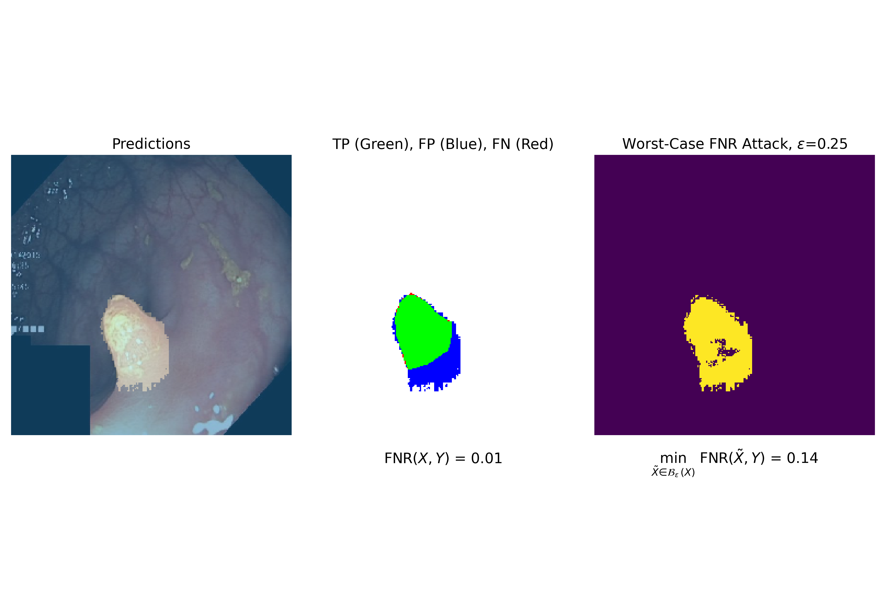

# Certifiably Robust Semantic Segmentation via Lipschitz Constrained Networks

> Code for the paper: "Fast and Flexible Robustness Certificates for Semantic Segmentation".




### Training Lipschitz-constrained Neural Networks on Segmentation Tasks

In this repository, we provide a PyTorch implementation of DeepLabV3 neural segmentation networks with Lipschitz constant
estimates. Furthermore, we leverage these constants to efficiently certify the worst case behaviour of the network under
adversarial attacks. 

### Install and run code

```bash

# Create an env and run
pip install -e .

# You can infer a Lipschitz network using the scripts/infer.py file:
./experiments/infer.sh

```

